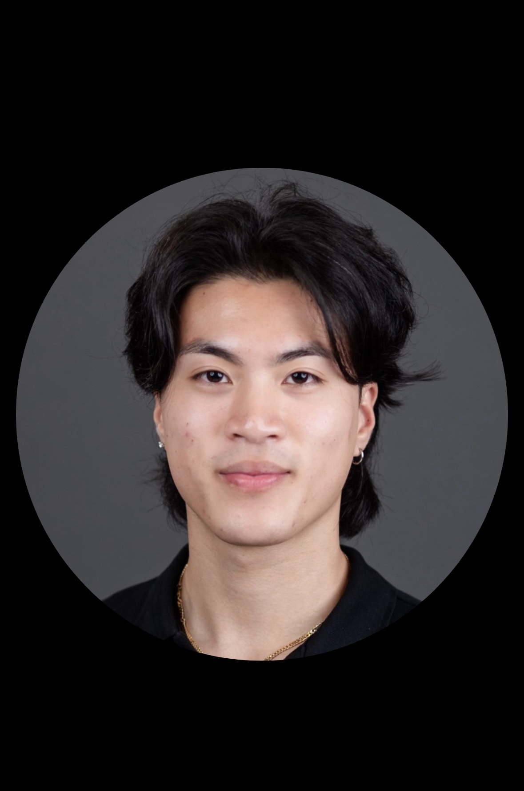

# Vincent's User Page
*made for CSE110*

## Where and When Did my Journey Begin?
> Hello World

I would have never known that my journey to becoming a programmer and software engineer would have began with such a simple quote from above! I began to code in the summer of 2022 at my community college in Sacramento. At **Folsom Lake College**, I began having aspirations in learning computer science! Now, I am a 3rd year Computer student at UC San Diego and I am excited for the rest of the journey! I enjoy working out, hiking, and nature walks! Lastly, my name is Vincent Trinh!


```python
def hello_world():
    print("Hello, world and Folsom Lake College!")
```

## Link to Task Section!
[Click this, it'll bring you to the task section](#task-section)

## Feel free to click on these links!
[My LinkedIn](https://www.linkedin.com/in/vincent-trinh-3a9963277/)  and   [My Github](https://github.com/Vkt5451)




## Task Section
[Relative link to README.md](README.md)


This is my current task list:
+ Finish LAB 1
+ Connect with my CSE110 Group
+ Do 2 leetcode problems

1. Finish LAB1
2. Do 2 leetcode problems

- [x] Task 1
- [ ] Task 2
