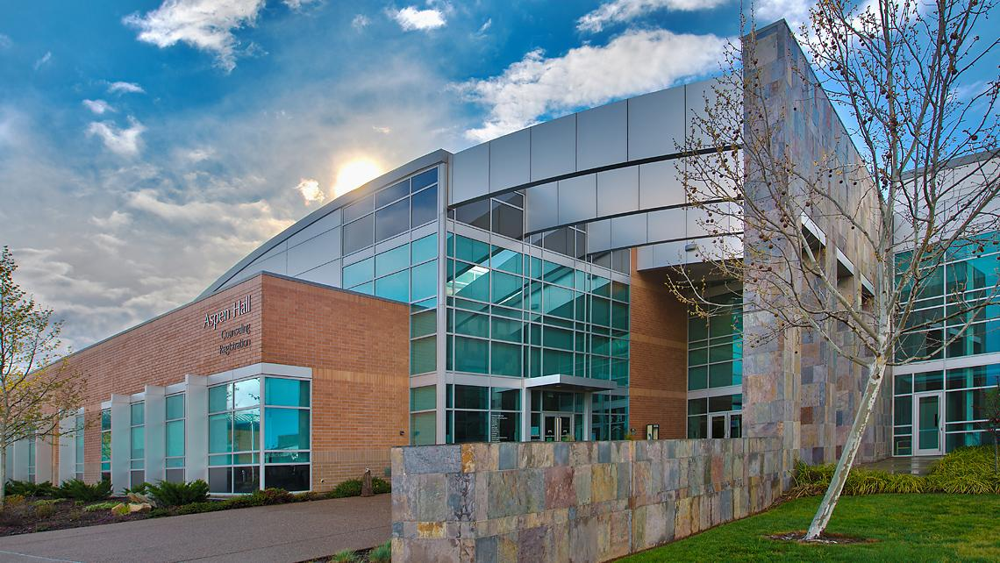

# Vincent's User Page
**made for CSE110**

## Where and When Did my Journey Begin?
>Hello World
 I would have never known that my journey to becoming a programmer and software engineerbegin with such a simple quote! I began to program in the summer of 2022 at my community college. At Folsom Lake College, I begin having aspirations in learning computer science!



```python
def hello_world():
    print("Hello, world and Folsom Lake College!")
```

## Feel free to click on these links!
[My LinkedIn](https://www.linkedin.com/in/vincent-trinh-3a9963277/)
[My Github](https://github.com/Vkt5451)

## Link to another section!
[This_should_bring_you_a_few_lines_down](#next-section)


## Next Section
[Relative_link](README.md)


This is my current task list:
+ Finish LAB 1
+ Connect with my CSE110 Group
+ Do 2 leetcode problems

Finish LAB1
Do 2 leetcode problems

[x] Task 1
[ ] Task 2
